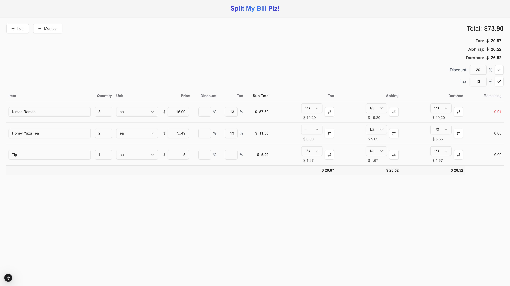
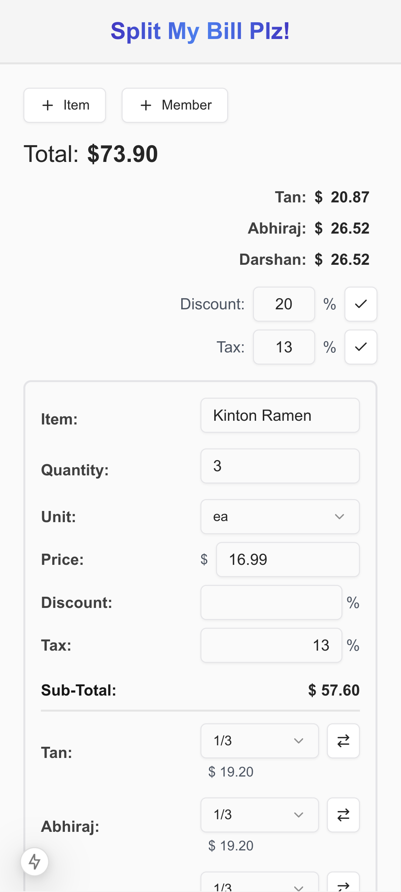

# Split My Bill Plz

Split My Bill Plz is a web application designed to help users easily split bills among multiple members. The application provides a user-friendly interface to add items, assign shares to members, and calculate the total amount each member owes.

## Features

- **Add Items**: Easily add items to the bill with details such as quantity, unit, price, discount, and tax.
- **Add Members**: Add members to the bill and assign shares to each member.
- **Toggle Input Type**: Toggle between dropdown and text input for member shares.
- **Calculate Totals**: Automatically calculate the subtotal, discount, tax, and total amount for each item and member.
- **Responsive Design**: Optimized for both desktop and mobile views.

## Screenshots

<div style="display: flex; gap: 10px;">
  
  
</div>

## Changelog

- **Refactored**: Split component for improved readability and maintainability.
- **Added**: Toggle functionality for input type (dropdown/text) for member shares.
- **Improved**: UI alignment and spacing for mobile view.
- **Enhanced**: Display of calculated member shares and remaining amounts.
- **Updated**: Predefined shares to include additional options.
- **Ensured**: Consistent styling across components and states.

## Getting Started

To get started with Split My Bill Plz, follow these steps:

1. **Clone the repository**:
   ```sh
   git clone <repository-url>
   ```
2. **Install dependencies**:
   ```sh
   npm install
   ```
3. **Run the application**:
   ```sh
   npm start
   ```
4. **Open the application**: Open your browser and navigate to `http://localhost:3000`.

## Contributing

We welcome contributions to Split My Bill Plz! If you have any ideas, suggestions, or bug reports, please open an issue or submit a pull request.

## License

This project is licensed under the MIT License. See the LICENSE file for details.

Thank you for using Split My Bill Plz! If you have any questions or need further assistance, please feel free to contact us.
