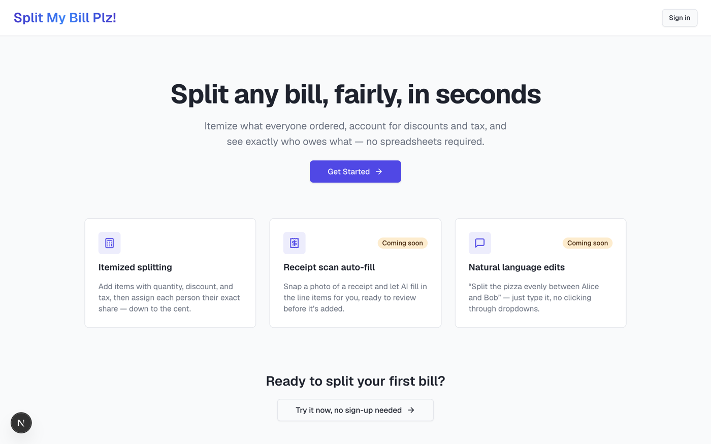
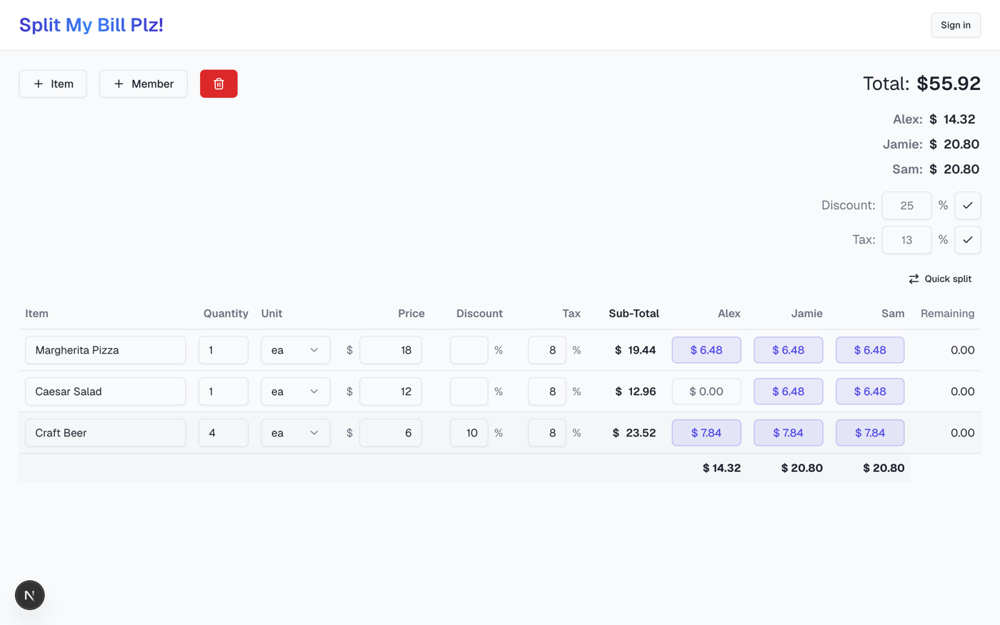
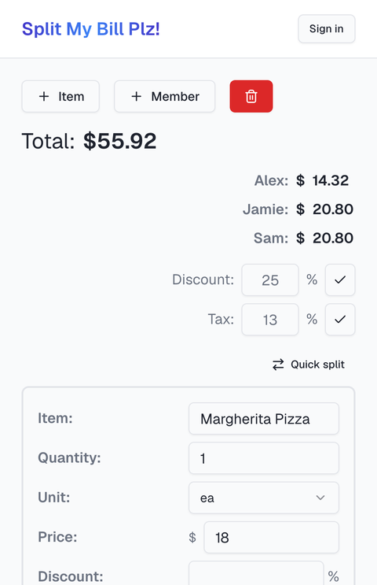

# Split My Bill Plz

Split any bill, fairly, in seconds. Itemize what everyone ordered, account for discounts and tax, and see exactly who owes what — no spreadsheets, no sign-up required.

[](https://github.com/abhirajshourya/smbp/actions/workflows/ci.yml)


## Screenshots

| Landing | Desktop | Mobile |
| :--: | :--: | :--: |
|  |  |  |

## Features

- **Itemized splitting** — add items with quantity, unit, price, discount, and tax, and see each item's exact subtotal.
- **Quick split chips** — click a member's chip on any item to include or exclude them; the share divides evenly across whoever's included, automatically.
- **Custom percentages** — toggle to "Custom %" for an exact, uneven split on any item.
- **Global discount/tax** — apply a discount or tax rate to every item at once, with new items inheriting it automatically.
- **No sign-up required** — everything works instantly in the browser, saved locally as you go.
- **Responsive by design** — a full data table on desktop, a card-based layout on mobile.

### Coming soon

- 📷 **Receipt scan auto-fill** — snap a photo of a receipt and let AI fill in the line items for you, ready to review before it's added.
- 💬 **Natural language edits** — "split the pizza evenly between Alice and Bob," just type it, no clicking through dropdowns.

## Tech stack

- [Next.js](https://nextjs.org/) (App Router) + [React](https://react.dev/) + [TypeScript](https://www.typescriptlang.org/)
- [Tailwind CSS](https://tailwindcss.com/) with a [shadcn/ui](https://ui.shadcn.com/) ("new-york") component set and [Radix UI](https://www.radix-ui.com/) primitives
- [lucide-react](https://lucide.dev/) icons

## Getting started

**Prerequisites:** Node.js 20+ and npm.

```sh
git clone https://github.com/abhirajshourya/smbp.git
cd smbp
npm install
npm run dev
```

Open [http://localhost:3000](http://localhost:3000) in your browser. The app hot-reloads as you edit.

Other scripts:

```sh
npm run build      # production build
npm run start      # run the production build
npm run typecheck  # type-check without emitting
npm run test:e2e   # Playwright end-to-end tests
```

## Contributing

Contributions are welcome! Please open an issue to discuss a change before submitting a pull request, especially for anything beyond a small fix.

There is intentionally no ESLint setup. This project runs TypeScript 7, which
replaced the classic JavaScript Compiler API with the native `tsgo` binary, and
`typescript-eslint` cannot parse TypeScript 7 at all — every version of
`eslint-config-next` depends on it, so ESLint could not read a single file in
`src/`. Rather than keep a config that errors on startup, linting was removed;
`npm run typecheck` is the check that actually runs. See
[typescript-eslint#10940](https://github.com/typescript-eslint/typescript-eslint/issues/10940)
for upstream progress.

## License

Licensed under the [MIT License](./LICENSE).
